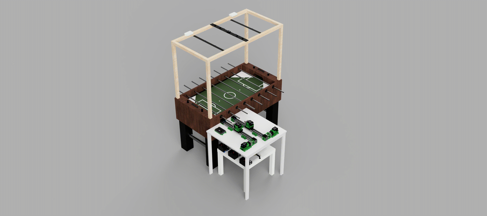
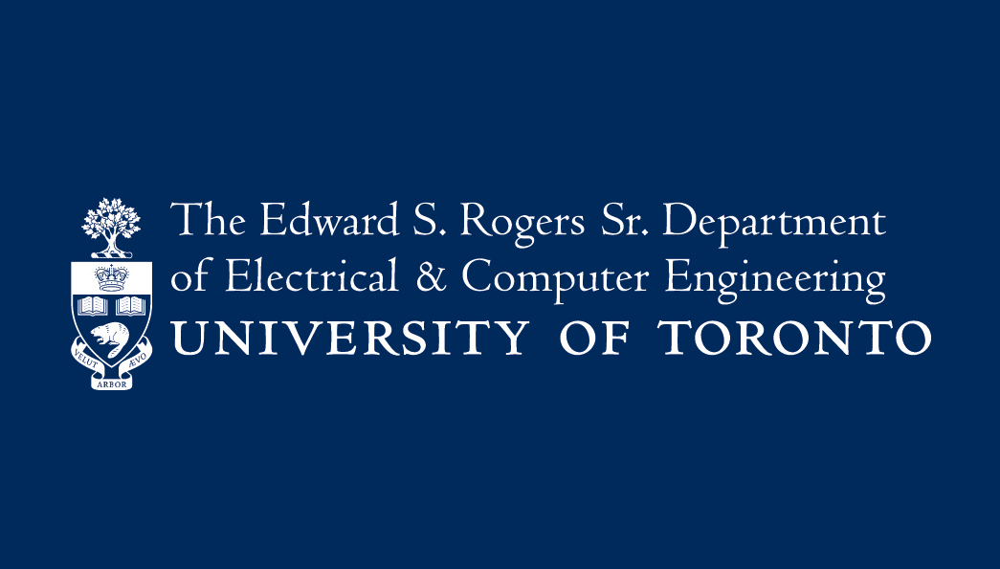

# Vision-Guided Automated Foosball Opponent

**ECE496Y Capstone Design Project | University of Toronto**
 
**Team 2025162**

An autonomous foosball opponent system that combines real-time computer vision, mechanical actuation, and control systems to create an engaging single-player foosball experience. The system uses overhead camera tracking to detect ball position and trajectory, then controls motorized rods to intercept and kick the ball with human-competitive reaction times.

**Key Features:**
- Real-time Vision Tracking: 100 FPS global shutter camera with OpenCV-based ball and player detection
- Dual-Motor Control: Independent rotational (kick) and translational (positioning) motors per rod
- Sub-200ms Reaction Time: Faster than average human reaction time of 250ms
- Non-Permanent Installation: Removable attachment system that preserves original table

✅ **Status:** Completed!
 
🎯 **Target Demo:** March 25-28, 2026
 
💵 **Budget:** [~$2.5k](https://github.com/danielz-yu/Automated_Foosball_Table_ECE496/blob/main/deliverables/Budget%20Estimate%20%7C%20Team%202025162.pdf)
 
🗓️ **Timeline:** Sept. 2025 - Mar. 2026

    

## 🎯 Project Goals
- Develop defensive gameplay capable of defending for 1+ minute against untrained players
- Achieve ball control at speeds up to 1 m/s
- Demonstrate practical integration of ECE concepts: computer vision, embedded systems, control theory, and mechatronics
- Create a reproducible design for future educational use

## 🏗️ System Architecture
**Vision System:**
- Camera: ArduCam OV9782 (100 FPS, global shutter, USB interface)
- Processing: Raspberry Pi 5 (16GB RAM)
- Mounting: Custom wooden stand with 3D-printed camera holder

**Mechatronics:**
- Rotational Motors: NEMA 23 Integrated Easy Servo (90W, 3000 RPM, 0.3 Nm)
- Translational Motors: NEMA 23 Integrated Easy Servo (180W, 3000 RPM, 0.6 Nm)
- Linear Actuators: HPVB45 Belt-driven system (400mm travel)
- Controller: Teknic ClearCore motor controller
- Custom Parts: 3D-printed couplers, mounts, and brackets

**Power Distribution:**
- Translational Servos: 2× MEAN WELL LRS-350-36
- Rotational Servos: 1× MEAN WELL LRS-600-36
- Controller: MEAN WELL LRS-350-24
- Raspberry Pi: 27W USB-C adapter

**Software Stack:**
- Language: Python 3.12
- Vision Processing: OpenCV (colour filtering, ArUco marker detection)
- Control: Teknic ClearCore API
- Communication: USB serial (Raspberry Pi ↔ ClearCore)

## 👥 Team Members
**Students:**
- Joonhan Ryu
- Luke Watson
- Daniel Yu
- Weiqing Zhang

**Supervisor:** Dr. Raviraj Adve
 
**Administrator:** Dr. Khoman Phang

## 📄 License
This project is developed as part of ECE496 at the University of Toronto. The design is open-source for educational purposes.

## 🙏 Acknowledgments
- Professor Adve, Professor Phang, Professor Prodić
- The Edward S. Rogers Sr. Department of Electrical & Computer Engineering, University of Toronto
- Robotics for Space Exploration Design Team
- ECE Club
- Canada Foosball

#

    

